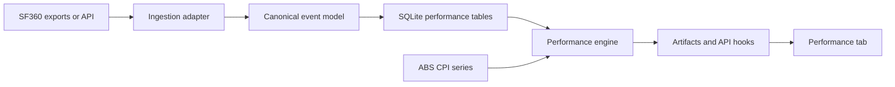

# Performance Module Plan

Date: 2026-06-08
Status: Planning document (no code changes)

## 1. Objective

Add a new Performance tab that measures actual portfolio outcomes and compares against objective:

- CPI + 5%

This module must support SMSF now and non-SMSF portfolios later.

Guiding principle:

- Portfolio is the output. The system is the asset.

## 2. Scope (Phase 1)

Deliver a first usable Performance tab without waiting for live SF360 transactions.

### UX cards

1. Current Value
2. Capital Sources
   - Rollover Capital
   - Contributions
   - Investment Returns
3. Performance vs Objective table
   - Since inception
   - 1Y, 3Y, 5Y, 10Y (where available)
   - Portfolio Return
   - CPI + 5%
   - Excess Return

### Phase 1 charts

1. Portfolio value over time
2. Portfolio return vs CPI + 5%
3. Rolling 3Y return vs CPI + 5%

Deferred to later phase:

- Drawdown chart
- Contributions vs investment growth stacked view
- Growth of 100,000 chart
- Member-level performance panels

## 3. Architecture

### Responsibility split

SF360 system of record:

- Accounting events and classifications
- Holdings, units, cost base, market values
- Member balances and member transactions

Application system of intelligence:

- Event normalization and data quality checks
- Daily valuation timeline construction
- TWR and MWR calculations
- CPI + 5% benchmark construction
- Excess return and rolling metrics
- Visualization and explainability

SQLite responsibilities:

- Store normalized facts and derived performance series
- Retain calculation versions for reproducibility
- Support local-first deterministic recalculation

## 4. Data model (proposed)

### portfolio

- id (pk)
- code
- name
- structure_type (SMSF, FamilyTrust, Other)
- base_currency
- inception_date
- objective_type (CPI_PLUS_SPREAD)
- objective_spread_bps (500)
- created_at, updated_at

### portfolio_valuation

- id (pk)
- portfolio_id (fk)
- valuation_date
- gross_assets
- liabilities
- net_assets
- cash_balance
- valuation_cutoff (default: end_of_day)
- is_final
- source_system (SF360, derived)
- source_ref
- quality_flag
- created_at

### cash_flow

- id (pk)
- portfolio_id (fk)
- flow_date
- amount
- direction (IN, OUT)
- flow_type (ROLLOVER, CONTRIBUTION_EMPLOYER, CONTRIBUTION_PERSONAL, PENSION_PAYMENT, FEE, TAX, TRANSFER, OTHER)
- is_external_flow (boolean)
- twr_treatment (NEUTRALIZE, INCLUDE)
- flow_timing (default: end_of_day)
- member_id (nullable)
- source_ref
- note
- created_at

### holdings_snapshot

- id (pk)
- portfolio_id (fk)
- snapshot_date
- instrument_code
- units
- market_price
- market_value
- cost_base
- source_ref
- created_at

### benchmark_series

- id (pk)
- benchmark_code (CPI_3Y, CPI_PLUS_5_3Y, CPI_PLUS_5_TOTAL)
- date
- level
- period_return
- source (ABS)
- source_version
- created_at

### performance_metrics

- id (pk)
- portfolio_id (fk)
- as_of_date
- period_code (SI, 1Y, 3Y, 5Y, 10Y)
- twr_annualized
- mwr_annualized (nullable in phase 1)
- benchmark_annualized
- excess_annualized
- volatility_annualized (nullable phase 1)
- max_drawdown (nullable phase 1)
- calculation_version
- created_at

### Optional later: unit_registry

- id (pk)
- portfolio_id (fk)
- date
- nav_before_flow
- external_flow
- units_issued
- units_redeemed
- units_outstanding
- unit_price
- created_at

## 5. Calculation policy

### 5.1 Return definitions

TWR (primary headline):

- Daily subperiod return: r_t = (V_t - V_{t-1} - CF_t) / V_{t-1}
- Linked return over period: product(1 + r_t) - 1
- Phase 1 timing assumption: external cash flows are treated as occurring at close of business on the recorded flow date.
- This end-of-day assumption is sufficient for phase 1 and can be refined later if intraday timing is required.

MWR (secondary):

- XIRR over dated cash flows and terminal valuation
- Used for member experience lens, not manager skill

### 5.2 Objective benchmark

Use geometric objective:

- objective_return = (1 + CPI_return) * (1 + 0.05) - 1

Use one policy consistently for all periods and display in glossary/help.

Glossary note (required):

- Daily returns assume external cash flows occur at close of business on the recorded flow date.

### 5.3 Capital sources decomposition

At as-of date:

- Rollover Capital = cumulative external rollovers in
- Contributions = cumulative net contribution flows
- Investment Returns = Current Value - Rollover Capital - Contributions

### 5.4 Cash flow treatment policy (TWR)

Rule:

- External capital flows are neutralized for TWR.
- Portfolio operating and investment costs remain in return outcomes.

Policy table:

| Flow type | External flow for TWR | Treatment |
|---|---|---|
| Rollover In/Out | Yes | Neutralize |
| Employer Contribution | Yes | Neutralize |
| Personal Contribution | Yes | Neutralize |
| Pension Payment | Yes | Neutralize |
| Benefit Payment | Yes | Neutralize |
| Brokerage | No | Include in return |
| Investment Management Fees | No | Include in return |
| Administration Fees | No | Include in return |
| Audit Fees | No | Include in return |
| Tax Payments | No | Include in return (phase 1 post-tax view) |

Future option:

- Add a pre-tax view later where tax treatment can be configured separately.

## 6. SF360 integration strategy

Do not block phase 1 on live SF360.

### Pre-live approach

1. Build canonical schema and engine now
2. Seed with controlled CSV fixtures and manual events
3. Validate formula outputs with deterministic test cases

### Live cutover approach

1. Add SF360 adapter mapping into canonical tables
2. Run first-month parallel reconciliation
3. Freeze mapping rules after validation

## 7. Implementation phases

### Phase 1A: Performance engine foundations

Deliver:

- SQLite tables: portfolio, portfolio_valuation, cash_flow, benchmark_series, performance_metrics
- Deterministic fixture dataset and test harness
- TWR calculation engine
- CPI + 5% benchmark series construction

Acceptance criteria:

1. Fixture scenarios pass with known expected values
2. TWR is contribution-neutral for external flow scenarios
3. Fees and operating costs remain included in returns
4. Deterministic outputs from identical input dataset

### Phase 1B: Performance UI

Deliver:

- Performance tab skeleton and cards
- Current Value and Capital Sources
- TWR-based table vs CPI + 5% (SI, 1Y, 3Y, 5Y, 10Y)
- Three core charts listed above

Acceptance criteria:

1. Excess return matches table math for every period
2. Missing-period handling shows explicit n/a, not zeros
3. All metrics traceable to stored dates and values

### Phase 1C: Validation and controls

Deliver:

- Reconciliation tests against fixture outputs
- Benchmark verification checks
- Data quality checks and warnings

Acceptance criteria:

1. Calculation confidence established before advanced analytics
2. Validation logs show pass/fail evidence per run

### Phase 2: Daily history hardening

Deliver:

- holdings_snapshot ingestion
- Daily valuation quality checks and gap handling
- Drawdown and contributions-vs-growth visuals

Acceptance criteria:

1. Daily continuity checks pass or flag exceptions
2. Recompute of history preserves previous validated outputs

### Phase 3: Member-level reporting and MWR

Deliver:

- Member-level MWR panels
- Member contribution and benefit flow summaries
- Optional shadow unit-registry prototype

Acceptance criteria:

1. Member-level totals reconcile to portfolio-level totals
2. MWR engine tested with known cash flow scenarios

### Phase 4: Advanced analytics

Deliver:

- Attribution extensions
- Risk overlays and governance alerts

## 8. Unit registry recommendation

Recommendation:

- Keep unit registry optional until phase 3.

Pros:

- Cleaner contribution-neutral accounting
- Better member ownership tracking

Cons:

- More operational complexity and reconciliation burden

Decision gate:

- Implement only when member-level ownership reporting needs exceed simple cash-flow and balance methods.

Compatibility assessment (phase 1 design):

1. `portfolio_valuation` plus `cash_flow` are sufficient foundations for a future shadow unit registry.
2. Added now for forward compatibility:
   - `portfolio_valuation.valuation_cutoff`
   - `portfolio_valuation.is_final`
   - `cash_flow.is_external_flow`
   - `cash_flow.twr_treatment`
   - `cash_flow.flow_timing`
3. Assumptions to avoid (to preserve unit-pricing optionality):
   - Do not hardcode one flow class as always external without table-driven mapping.
   - Do not overwrite historical valuation rows in place.
   - Do not assume missing valuation days can be silently forward-filled for performance math.

## 9. Auditability and controls

1. Store source_ref for every imported row
2. Keep calculation_version on every metric row
3. Never overwrite historical rows silently
4. Emit data quality warnings for:
   - Missing valuation dates
   - Unexpected flow sign
   - Benchmark coverage gaps

## 10. Immediate next actions

1. Approve this phase plan
2. Confirm benchmark convention wording for UI and glossary
3. Create SQLite migration for phase 1A tables and compatibility fields
4. Build deterministic fixture dataset and expected-output assertions before UI work
5. Execute phase 1A, then 1B, then 1C in sequence

## 11. Deterministic fixture scenarios (required before UI)

Create a permanent test harness with hand-checkable expected outcomes.

### Scenario 1

- Initial rollover
- No contributions
- Simple portfolio growth
- Purpose: baseline TWR correctness

### Scenario 2

- Mid-period contribution
- Portfolio growth before and after contribution
- Purpose: confirm TWR remains contribution-neutral

### Scenario 3

- Contribution plus fee payments
- Purpose: confirm fee treatment remains included in reported returns

### Scenario 4

- Market decline followed by recovery
- Purpose: validate rolling return behavior and period-window handling
