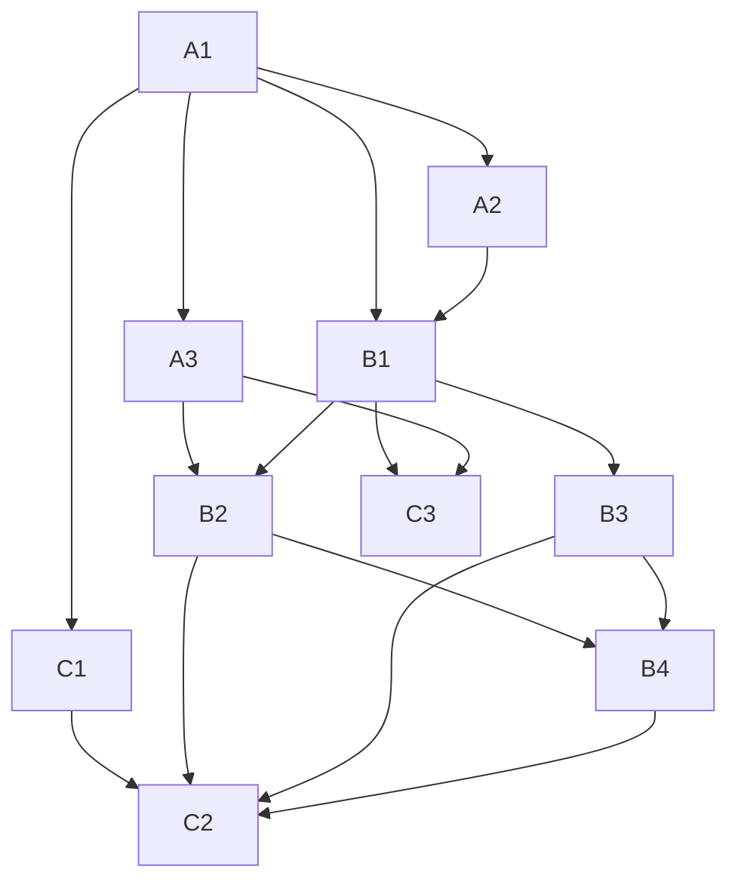

# Performance Module Phase 1A Backlog

Date: 2026-06-08
Status: Ready for implementation planning
Related plan: docs/performance-module-plan.md

## 1. Phase 1A outcome

Build the performance engine foundations before UI work:

1. Canonical SQLite schema for performance facts
2. Deterministic fixture dataset with known expected outcomes
3. TWR engine with explicit cash flow policy
4. CPI + 5% benchmark construction
5. Validation and reconciliation tests

Exit criteria:

1. Engine outputs are deterministic and explainable
2. TWR treatment for external flows and fees is validated
3. Benchmark comparison is reproducible and versioned
4. All tests pass for fixture scenarios

## 2. Epic breakdown

### Epic A: Data foundations

Goal: persist the minimum data model required to calculate performance correctly.

### Epic B: Calculation engine

Goal: compute TWR and objective benchmark with policy-compliant treatment of flows.

### Epic C: Test harness and validation

Goal: lock in calculation integrity before any Performance tab UI is built.

## 3. Ticket-ready backlog

Use this format directly in your tracker.

### A1. Create performance tables migration

Type: Task
Priority: P0
Estimate: 1 day
Dependencies: None

Scope:

1. Add tables:
   - portfolio
   - portfolio_valuation
   - cash_flow
   - benchmark_series
   - performance_metrics
2. Include forward-compatibility fields:
   - portfolio_valuation.valuation_cutoff
   - portfolio_valuation.is_final
   - cash_flow.is_external_flow
   - cash_flow.twr_treatment
   - cash_flow.flow_timing
3. Add created_at columns and required NOT NULL constraints.

Acceptance criteria:

1. Migration applies cleanly on empty DB
2. Migration is idempotent in normal pipeline use
3. Schema matches approved plan definitions

### A2. Add indexes and integrity constraints

Type: Task
Priority: P0
Estimate: 0.5 day
Dependencies: A1

Scope:

1. Indexes:
   - portfolio_valuation(portfolio_id, valuation_date)
   - cash_flow(portfolio_id, flow_date)
   - benchmark_series(benchmark_code, date)
   - performance_metrics(portfolio_id, as_of_date, period_code)
2. Constraints:
   - unique valuation date per portfolio
   - allowed enums/check constraints for twr_treatment and flow_timing

Acceptance criteria:

1. Query plan uses indexes for typical period-range reads
2. Invalid enum-like values are rejected

### A3. Implement canonical flow classification mapping

Type: Task
Priority: P0
Estimate: 1 day
Dependencies: A1

Scope:

1. Define classification map from source flow types to:
   - is_external_flow
   - twr_treatment (NEUTRALIZE or INCLUDE)
2. Implement default policy:
   - Rollover/Contribution/Pension/Benefit: NEUTRALIZE
   - Brokerage/Fees/Taxes: INCLUDE
3. Emit warnings for unknown flow types.

Acceptance criteria:

1. Each ingested cash flow gets explicit treatment fields
2. Unknown flow types produce visible warnings and fail strict mode

### B1. Build daily valuation timeline loader

Type: Task
Priority: P0
Estimate: 1 day
Dependencies: A1, A2

Scope:

1. Load valuation rows for a portfolio and date range
2. Validate continuity and ordering
3. Flag missing or duplicate valuation dates

Acceptance criteria:

1. Loader returns deterministic ordered valuation series
2. Data quality issues are surfaced in logs/report

### B2. Implement TWR calculator (daily linked)

Type: Task
Priority: P0
Estimate: 1.5 days
Dependencies: A3, B1

Scope:

1. Calculate daily subperiod returns:
   - r_t = (V_t - V_{t-1} - CF_t_external) / V_{t-1}
2. Use end-of-day external flow assumption
3. Link returns geometrically for SI/1Y/3Y/5Y/10Y windows

Acceptance criteria:

1. External flows are neutralized
2. Included-cost flows remain in outcomes
3. Window calculations return n/a when insufficient history

### B3. Implement CPI + 5% benchmark builder

Type: Task
Priority: P0
Estimate: 1 day
Dependencies: B1

Scope:

1. Consume CPI series from existing artifact pipeline
2. Construct objective return series using geometric rule:
   - objective = (1 + CPI) * (1 + 0.05) - 1
3. Persist benchmark series with source_version metadata

Acceptance criteria:

1. Benchmark series is reproducible for same CPI input
2. Date alignment with portfolio valuation windows is explicit

### B4. Compute and persist performance_metrics rows

Type: Task
Priority: P0
Estimate: 1 day
Dependencies: B2, B3

Scope:

1. For SI/1Y/3Y/5Y/10Y compute:
   - twr_annualized
   - benchmark_annualized
   - excess_annualized
2. Persist calculation_version on every row

Acceptance criteria:

1. excess_annualized equals twr_annualized minus benchmark_annualized
2. Repeat runs with unchanged input produce identical values

### C1. Create deterministic fixture dataset

Type: Task
Priority: P0
Estimate: 1 day
Dependencies: A1

Scope:

1. Create fixture files for four scenarios:
   - Scenario 1: initial rollover, no contributions, simple growth
   - Scenario 2: mid-period contribution with growth before/after
   - Scenario 3: contribution plus fees
   - Scenario 4: decline then recovery
2. Store expected outputs for each scenario and period window

Acceptance criteria:

1. Expected results are hand-verified and documented
2. Fixtures are small, readable, and deterministic

### C2. Build engine verification tests

Type: Task
Priority: P0
Estimate: 1 day
Dependencies: C1, B2, B3, B4

Scope:

1. Tests for:
   - flow treatment correctness
   - contribution neutrality
   - fee inclusion behavior
   - benchmark construction
   - period-window n/a handling
2. Snapshot or exact-value assertions for expected metrics

Acceptance criteria:

1. All fixture scenarios pass
2. Failures produce clear diagnostic output

### C3. Add data quality checks report

Type: Task
Priority: P1
Estimate: 0.5 day
Dependencies: B1, A3

Scope:

1. Report checks for:
   - missing valuation dates
   - duplicate valuation rows
   - unknown flow types
   - benchmark coverage gaps

Acceptance criteria:

1. Report can be run in CI/local pipeline
2. Warning and fail thresholds are configurable

## 4. Dependency graph

## 5. Definition of done for Phase 1A

Phase 1A is complete only when all are true:

1. Migrations and indexes are in place and documented
2. Flow classification policy is implemented and test-covered
3. TWR + CPI+5 outputs are persisted for all available windows
4. Deterministic fixtures and expected outputs are version-controlled
5. Validation test suite passes in local and CI runs
6. Data quality report is available and reviewed

## 6. Suggested implementation order (execution)

1. A1 -> A2 -> A3
2. B1 -> B2 -> B3 -> B4
3. C1 -> C2 -> C3

Then proceed to Phase 1B (UI).

## 7. Risks and mitigations

### Risk: ambiguous flow classification from future SF360 exports

Mitigation:

1. Keep policy mapping table-driven
2. Fail strict mode on unknown classes
3. Add explicit overrides file for transitional periods

### Risk: benchmark alignment mismatch against valuation dates

Mitigation:

1. Enforce explicit date alignment policy
2. Validate coverage per period window
3. Surface benchmark gap warnings

### Risk: silent recalculation drift

Mitigation:

1. calculation_version in persisted metrics
2. fixture-based regression tests
3. no silent overwrite of historical validated outputs
